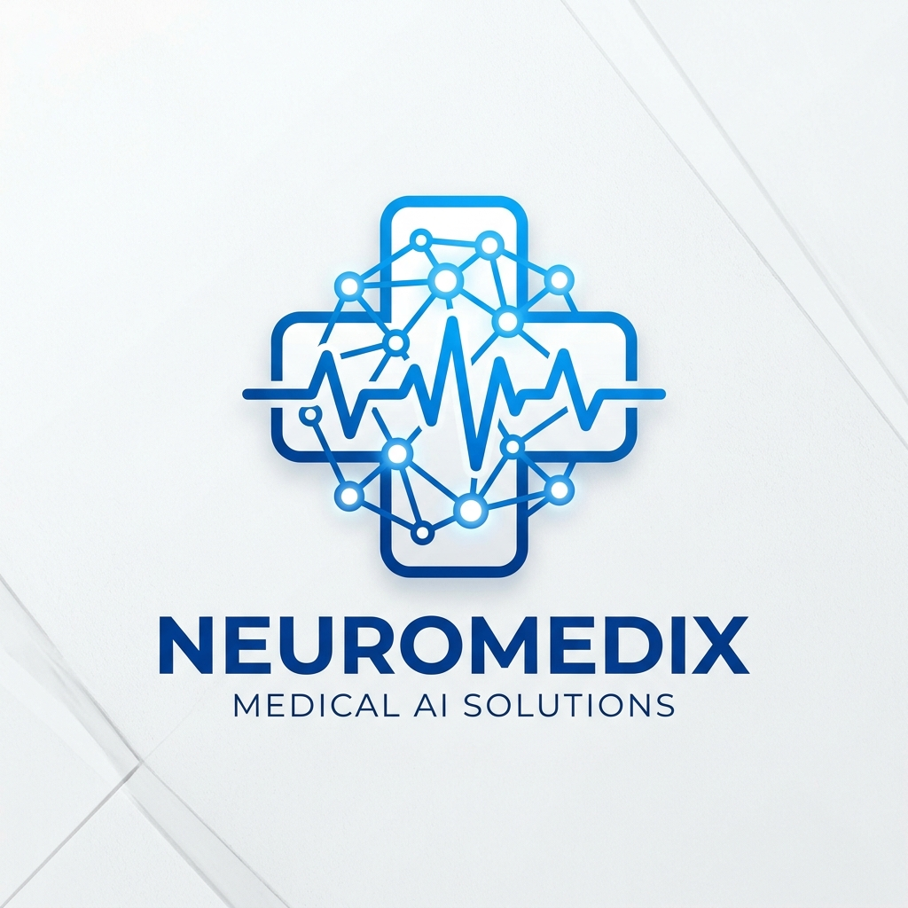

<div align="center">
  
  <h1>🏥 VitalAssist AI: Enterprise Medical Document Assistant</h1>
  <p><strong>Next-Generation Clinical Document Processing, RAG Chatbot, and Intelligence Dashboard</strong></p>
  
  [](https://www.python.org/downloads/)
  [](https://streamlit.io)
  [](https://python.langchain.com/docs/langgraph)
  [](https://groq.com)
</div>

<hr/>

## 📖 Overview

**VitalAssist AI** is an enterprise-grade medical application designed to automate the extraction, analysis, and querying of clinical documents. Leveraging state-of-the-art Optical Character Recognition (OCR), Multi-Agent AI Workflows, and Retrieval-Augmented Generation (RAG), it transforms unstructured medical reports (PDFs, Images) into structured clinical insights.

Built with a premium **Glassmorphism UI** using Streamlit, the application provides a secure, intuitive experience for healthcare professionals, insurance officers, and medical coders.

---

## ✨ Key Features

*   **📄 Advanced Document Processing (OCR):** Extracts text from clinical PDFs and images using robust pipelines (`PyMuPDF`, `pdfplumber`, `PaddleOCR`) with automated image preprocessing (denoising, thresholding, sharpening) via `OpenCV`.
*   **🤖 Multi-Agent Workflow (LangGraph):** Automates complex cognitive tasks:
    *   **Summary Agent:** Generates executive clinical summaries.
    *   **Diagnosis Agent:** Extracts diseases, symptoms, and medications.
    *   **Insurance Agent:** Verifies policy status and coverage eligibility.
    *   **Coding Agent:** Generates relevant ICD-10 and CPT codes.
*   **💬 Medical RAG Chatbot:** Ask complex questions about the uploaded patient report. Powered by **ChromaDB**, **HuggingFace Embeddings** (`all-MiniLM-L6-v2`), and **Groq Llama-3.3-70B**, ensuring deep, detailed, and context-aware responses without hallucinations.
*   **📊 Live Analytics Dashboard:** Visualizes document processing metrics in real-time. Tracks total reports, unique diagnoses, top medications, and monthly volume trends using interactive `Plotly` charts.
*   **🔐 Secure Authentication:** Role-based access control (Doctor, Admin, Insurance Officer) backed by an encrypted SQLite database.

---

## 🛠️ Technology Stack

| Component | Technology |
| :--- | :--- |
| **Frontend UI** | Streamlit, Plotly, HTML/CSS (Glassmorphism) |
| **Core Logic & Flow** | Python, LangChain, LangGraph |
| **LLM Inference** | Groq API (`llama-3.3-70b-versatile`) |
| **Vector Database** | ChromaDB (Local Persistence) |
| **Embeddings** | HuggingFace (`sentence-transformers/all-MiniLM-L6-v2`) |
| **OCR & Vision** | PaddleOCR, PyMuPDF, pdfplumber, OpenCV, PIL |
| **Database (Auth & Logs)** | SQLite, SQLAlchemy |

---

## 🚀 Getting Started

### Prerequisites
*   Python 3.9 or higher
*   Git
*   [Groq API Key](https://console.groq.com/keys)

### 1. Clone the Repository
```bash
git clone https://github.com/yourusername/medical-ai-assistant.git
cd medical-ai-assistant
```

### 2. Set Up Virtual Environment
```bash
python -m venv venv
# On Windows
venv\Scripts\activate
# On macOS/Linux
source venv/bin/activate
```

### 3. Install Dependencies
```bash
pip install -r requirements.txt
```

### 4. Environment Configuration
Create a `.env` file in the root directory and add the following:
```env
GROQ_API_KEY=your_groq_api_key_here
MODEL_NAME=llama-3.3-70b-versatile
CHROMA_DB_PATH=./embeddings
JWT_SECRET_KEY=your_super_secret_jwt_key_here
DATABASE_URL=sqlite:///./medical_ai.db
DEBUG=True
```

### 5. Run the Application
```bash
streamlit run app.py
```
*The app will be accessible at `http://localhost:8501`*

---

## 📂 Project Structure

```text
medical-ai-assistant/
├── agents/                 # LangGraph Agent Definitions
│   ├── summary_agent.py
│   ├── diagnosis_agent.py
│   ├── insurance_agent.py
│   └── coding_agent.py
├── auth/                   # Authentication & Security
│   ├── login.py
│   ├── register.py
│   └── password_handler.py
├── dashboard/              # UI Analytics & Data Tracking
│   ├── analytics.py
│   └── data_tracker.py
├── database/               # SQLite Models & Engine
│   ├── db.py
│   └── models.py
├── llm/                    # Groq API Client & Prompts
│   ├── groq_client.py
│   └── prompts.py
├── ocr/                    # PDF Parsing & Vision Pipelines
│   ├── image_ocr.py
│   ├── pdf_parser.py
│   └── preprocess.py
├── rag/                    # Retrieval Augmented Generation
│   ├── chains.py
│   ├── chunking.py
│   └── vector_store.py
├── workflows/              # Multi-Agent Graph Logic
│   └── langgraph_flow.py
├── uploads/                # Temporary Document Storage
├── embeddings/             # Persistent ChromaDB Storage
├── .env                    # Environment Variables
├── requirements.txt        # Python Dependencies
└── app.py                  # Main Streamlit Application
```

---

## ⚙️ Usage Guide

1.  **Register/Login:** Create a new account with a specific role (e.g., Doctor, Admin) and log in.
2.  **Dashboard:** View high-level system metrics and recent processing activity.
3.  **Document Processing:** Upload a clinical PDF or image. The system will automatically extract text, index it for the RAG chatbot, and run the Multi-Agent workflow to extract Summary, Diagnosis, Insurance info, and Codes.
4.  **RAG Chatbot:** Switch to the Chatbot tab to ask specific questions about the uploaded document (e.g., *"What is the prescribed dosage for Tamoxifen?"*). Use the **Clear Chat** button to wipe history and vector store before uploading a new patient report.
5.  **Analytics:** Review aggregate statistics, top diagnoses, and volume trends across all processed documents.

---

## ⚠️ Disclaimer

**For Research and Demonstration Purposes Only.** 
VitalAssist AI is a proof-of-concept application. It is not a certified medical device and should not be used for actual diagnostic, treatment, or clinical decision-making purposes without professional human oversight. Always comply with HIPAA and local data privacy regulations when handling Real Protected Health Information (PHI).

---
*Built with ❤️ by [Your Name/Team]*
